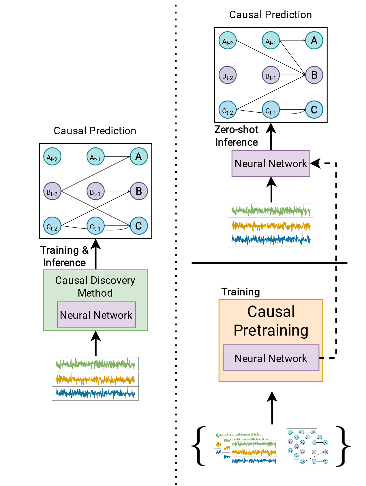

# CausalPretraining




This repository holds the official results for: arXiv


### Installation: 


The main environment can be installed with 

```
conda env create -f env_droplet.yml
```

Additionally, for PCMCI experiments, an additional environment can be installed via: 

```
conda env create -f env_tigramite_droplet.yml
```


### Usage

The project is loosely build upon (https://github.com/ashleve/lightning-hydra-template)


### DATA

To generate synthetic data samples run 

```
generate_synthetic_ds.py --scale_up --synthetic_six --joint
```

To prepare other data sources used in the paper, first download them here: 

1. Aerosols: wget -P data/ "https://github.com/anndvision/data/raw/main/jasmin/four_outputs_liqcf_pacific.csv"
2. Rivers: https://github.com/wasimahmadpk/deepCausality/tree/main/datasets/river_discharge_data
3. Kuramoto: https://github.com/loeweX/AmortizedCausalDiscovery

Then run: 
```
python generate_other_ds.py --kuramoto --aerosols --kuramoto_path path/to/download --aerosols_path path/to/download
```
to generate the proper formatting. The river dataset needs no formatting.

### Training

To simply train a default model with a small set of synthetic data samples run e.g.: 

```
python train.py model.model_type=transformer data.ds_name=SNL model=medium.yaml
```

Pretrained weights (Best Runs from the Joint Experiments and the size "big") are included in /pretrained_weights and can be used directly, e.g. as in ==make_graphs.ipynb==. (Be careful, you need correlation injection inputs)


### Reproduce

All baselines included in the paper can be recreated by running e.g. :

```
python calc_baselines.py --corr --synth --var
```
We provide a summary display in ==summarize_baseline_scorings.ipynb==.


The results of the grid searches are provided in ==summarize_cp_scorings.ipynb==. 
Further, zero-shot results as well as inference speeds for Causally Pretrained Neural Networks can be reproduced by running: 
```
python calc_cp_performance.py --rivers --aerosols --speed
```


Finally, the slurm scripts used for the grid search are included in /slurm and ==calc_dist_preds.py== can be used to calculate a distribution_over_outputs (Appendix, Paper)


Feel free to contact me if you would like to have any additional content/information/code  :sunglasses:


